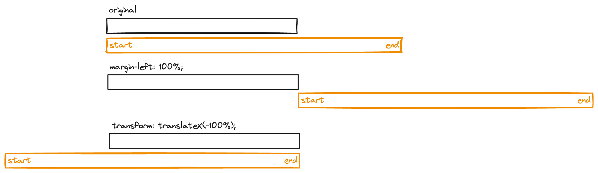
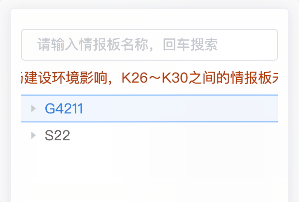

+++
author = "H. Wang"
title = "CSS超长内容自动滚动"
date = "2024-05-21"
description = "使用CSS实现超长内容自动滚动轮播"
tags = [
    "CSS"
]
categories = [
    "CSS"
]

image = ""
+++

## CSS超长内容自动滚动

场景为在限定的空间（宽度）内展示超出容器宽度范围的内容。此时若按不换行的方式展示，内容必定被遮挡，用户无法获取完整信息内容。当然可以尝试让超出显示为省略号，鼠标移入时展示完整内容。但此类方法有限制，如用户友好性低、复杂场景难实现等问题。

这里总结使用`CSS(animation)`实现超长内容自动滚动(轮播)效果。

首先需要一个固定宽度的容器包围超长内容，使超长内容能够在限定空间内滚动，这里使用`class`为`scroll-wrap`的div作为父容器，`class`为`scroll-item`的div作为超长内容div

```css
.scroll-wrap {
    max-width: 100%;
    margin: 10px 0;
    overflow: hidden;
    white-space: nowrap;
}
```

为父容器设定固定的最大宽度`max-width`，使用`overflow: hidden;`将超出的内容隐藏，另外在父容器或子容器中设置

`white-space: nowrap;`使文本超出容器宽度不换行。

而滚动效果动画加在子容器上：

```css
.scroll-item {
    color: #cc3d00;
    font-size: 14px;
    line-height: 1;
    float: left;
    animation: scroll linear 4s alternate infinite;
}
@keyframes scroll {
    0% {
        margin-left: 0;
        transform: translateX(0);
    }
    100% {
        margin-left: 100%;
        transform: translateX(-100%);
    }
}
```

`float: left;`让div居左显示，定义`keyframes`关键帧结合动画让div实现滚动效果。最终实现效果为开头文字居左显示，结束文字居右显示。`margin-left: 0; transform: translateX(0);`让div居左，在最终状态下，`margin-left: 100%;`让整个超长div最左边对齐到父div的最右边，`transform: translateX(-100%);`使超长div向左平移自身宽度100%，从而让超长div最右边对齐到父div的最右边。



最后再给动画加两个关键帧，使超长内容滚动在起始和结束位置停留

```css
@keyframes scroll {
    0% {
        margin-left: 0;
        transform: translateX(0);
    }

    10% {
        margin-left: 0;
        transform: translateX(0);
    }

    90% {
        margin-left: 100%;
        transform: translateX(-100%);
    }

    100% {
        margin-left: 100%;
        transform: translateX(-100%);
    }
}
```




