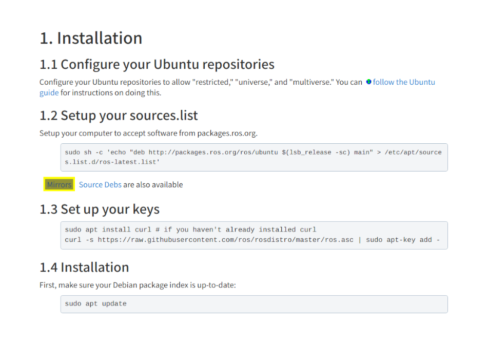
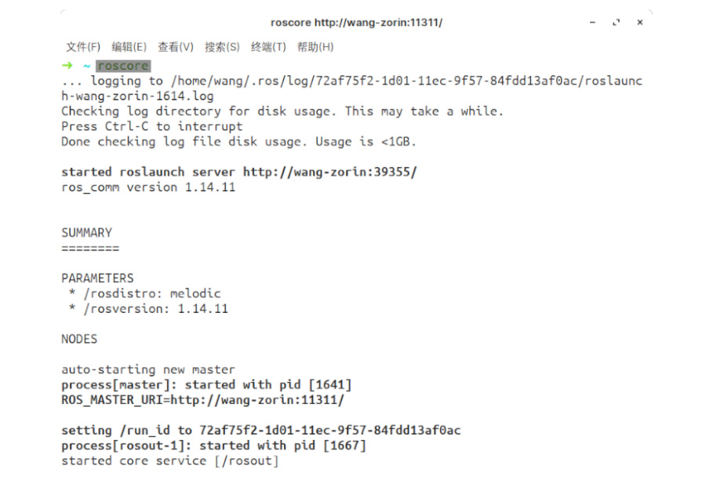

+++
author = "H. Wang"
title = "ROS Melodic Installation"
date = "2021-09-17"
description = "Ubuntu18.04 安装ROS"
tags = [
    "ROS",
    "Installation"
]
categories = [
    "ROS"
]

image = "ros-melodic.png"
+++

## ROS Wiki
[Ubuntu install of ROS Melodic](https://wiki.ros.org/melodic/Installation/Ubuntu)

较简单，按官方文档进行安装即可。
> Note
> - 选择国内镜像源进行配置安装, 如下图1中Mirrors
> - 安装完成在终端执行roscore测试安装情况，如下图2中执行结果所示

