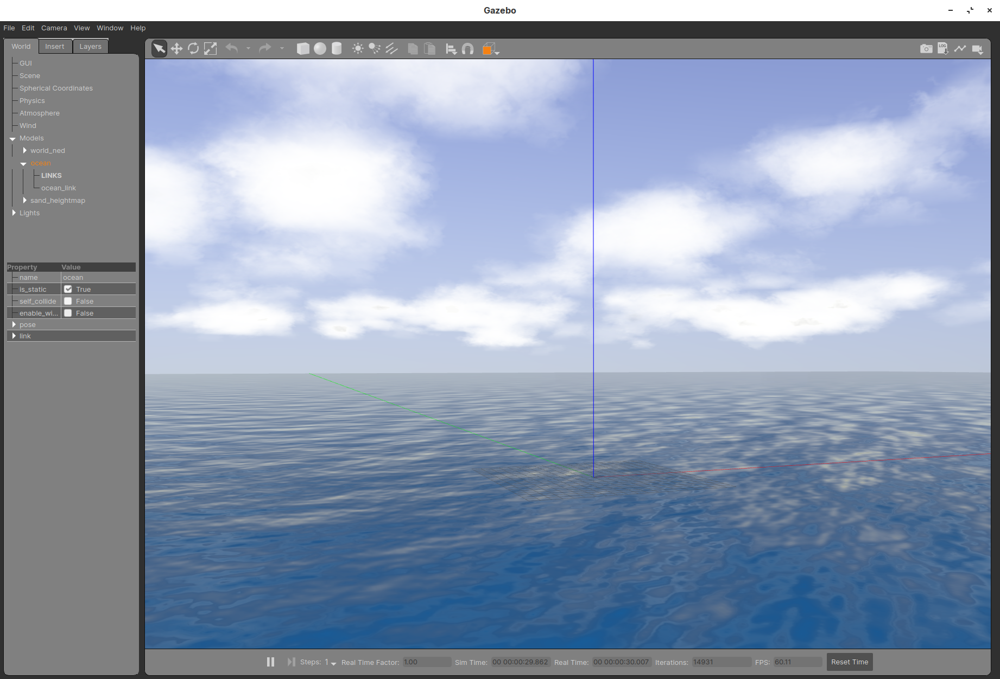

+++
author = "H. Wang"
title = "UUV Simulator Installation"
date = "2021-09-20"
description = "源码安装UUV Simulator."
tags = [
    "UUV Simulator",
    "Installation"
]
categories = [
    "ROS",
    "UUV Simulator"
]

image = "ocean_waves.png"
+++

## 0 依赖
UUV Simulator是基于`ROS`与`Gazebo`开发实现的，其安装依赖`ROS`和`catkin`工具

### 0.1 ROS
`Ubuntu18.04` 对应 `ROS Melodic`

ROS的安装请参考 [Docs中简单的安装介绍](https://h-wanng.github.io/p/ros-melodic-installation/) 或 [melodic/Installation/Ubuntu - ROS Wiki](https://wiki.ros.org/ROS/Installation)

### 0.2 catkin_tools
```sh
sudo apt-get install python3-catkin-tools
```

## 1 安装
源码安装基于 `ROS Melodic` 和 `Gazebo9` 的 `uuv-simulator`.
### 1.1 创建ROS工作空间
```sh
mkdir -p ~/catkin_ws/src
cd ~/catkin_ws/src
```
### 1.2 初始化catkin工作空间
```sh
cd ~/catkin_ws
catkin init
```
### 1.3 clone源码
```sh
cd ~/catkin_ws/src
git clone https://github.com/uuvsimulator/uuv_simulator.git
# 若从git clone 失败，使用国内 gitee 地址
# git clone https://gitee.com/h_wanng/uuv_simulator.git
```
### 1.4 软件包依赖安装
> **Note**: 如果安装ROS过程中最后一步依赖更新 `rosdep update` 失败，那么将会很大概率会影响本步操作。
```sh
cd ~/catkin_ws
rosdep install --from-paths src --ignore-src --rosdistro=melodic -y --skip-keys "gazebo gazebo_msgs gazebo_plugins gazebo_ros gazebo_ros_control gazebo_ros_pkgs"
```
### 1.5 编译
```sh
cd ~/catkin_ws
catkin_make install
```
> **Note**: 编译过程比较耗费内存，如果报错大多和内存相关。可以尝试：
> 1. 重复编译操作；
> 2. 增加虚拟内存(Swap)
### 1.6 配置环境变量
```sh
echo "source $HOME/catkin_ws/devel/setup.bash" >> ~/.bashrc
source ~/.bashrc
```
### 1.7 测试
```sh
roslaunch uuv_gazebo_worlds ocean_waves.launch
```
launch文件启动Gazebo后显示如下场景即安装成功



