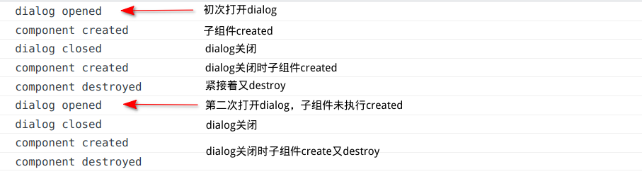

+++
author = "H. Wang"
title = "Vue & JS Issues"
date = "2022-11-14"
description = "Vue(和JS)的一些问题记录"
tags = [
    "Vue"
]
categories = [
    "Vue"
]

image = ""
+++

## Ruoyi 字典取值并回显到页面

```html
<el-table-column label="职级" align="center" key="job_grade" prop="job_grade" :show-overflow-tooltip="true" >
    <template slot-scope="scope">
        <dict-tag :options="dict.type.job_grade_type" :value="scope.row.job_grade" />
    </template>
</el-table-column>
```

通过 `slot-scope` `scope.row.job_grade` 获取当前column的prop，在字典中获取对应数据（label）

## Ruoyi vue下拉框取字典表值回显为数字不是文字

业务场景为点击`el-table-column`中的`修改`操作弹出dialog并自动填充当前行的实体信息。Dialog中表单其中一项为下拉框，数据绑定（v-model）的值为value，需要根据value从字典中取对应的label并回显。

具体实现中出现回显的是数字而非label文本。

原因为Ruoyi中字典数据表的键和值均为 `varchar` 类型，而自己的数据表相关字段为 `int`

```sql
`dict_label` varchar(100) DEFAULT '' COMMENT '字典标签',
`dict_value` varchar(100) DEFAULT '' COMMENT '字典键值',
```

解决方法：

1. 将数据表（实体）中的字段改为varchar。

2. 将value的值用Number包起来：
   
   ```html
   <el-select v-model="form.job_grade" clearable placeholder="请选择职级">
    <el-option
        v-for="dict in dict.type.job_grade_type"
        :key="dict.value"
        :label="dict.label"
        :value="Number(dict.value)"
        ></el-option>
   </el-select>
   ```
   
   ## JS中null和undefined
   
   遇见一个有意思的小问题。
   业务场景为Dialog中表单的数据提交，id没有值，后端通过雪花算法生成自增id，前端中JS异步传值（整个表单的值）。
   当表单参数中有初始化，且id默认设为null时，如：
   
   ```js
   form: {
    id: null,
    ...
   }
   ```
   
   后端接收到的数据为`"id": nil`。将id设置为'',也是一样的情况，最终导致，插入（insert）数据报错，错误信息大致为 字段被定义两次。

解决办法就是不初始化参数，或将其初始化为undefined。

[undefined和null的区别](https://blog.csdn.net/m0_47135993/article/details/119800231):
6、undefined和null的用途
null表示没有对象，即不应该有值，经常用作函数的参数，或作为原型链的重点。

undefined表示缺少值，即应该有值，但是还没有赋予（变量提升时默认会赋值为undefined，函数参数未提供默认为undefined，函数的返回值默认为undefined）
但不建议显式赋值为undefined：

```
建议：无论在什么情况下都没有必要将一个变量显示的赋值为undefined。如果需要定义某个变量来保存将来要使用的对象，应该将其初始化为null.
```

## Vue中标签中拼接变量

通过`v-bind`，如：

```html
<router-link v-bind:to="`/biz/tr/trainer_detail/index/${this.trainerId}`"></router-link>
<router-link :to="`/biz/tr/trainer_detail/index/${this.trainerId}`"></router-link>
```

## 页面返回后刷新数据

使用钩子函数

```js
activated() {
    //获取数据方法
    this.getList();
},
```

## 父子组件的值传递

TODO

props

## Vue组件中的CSS scoped

vue组件中，style标签中属性`scoped`。该属性会让该组件下的css样式只适用于本组件，而不会影响全局组件。

## Vue element ui 表格显示序号

```html
<el-table-column fixed label="序号" width="50" align="center">
    <template scope="scope">
        <span>{{scope.$index + 1}} </span>
    </template>
</el-table-column>
```

## 保存前端文件列表的问题

前端的上传的文件地址列表保存到数据库，后端报sql异常
`Incorrect string value: '\xAC\xED\x00\x05sr...' for column 'appendix' at row 1`

原因竟是没有`toString()` :D 列表 -> varchar？

## Vue动态加载组件问题

已知webpack支持动态加载，es6新增import()函数支持动态加载，import()返回一个 Promise 对象

https://blog.csdn.net/qq_38211205/article/details/124348464

动态加载组件可以写成：

```js
<template>
    <component :is="component"
        v-if="component" />
</template>
<script>

export default {
  name: 'test',
  props: ['data', 'type'],
  data() {
    return {
        component: null
    }
  },
  computed: {
    loader() {
      return () => import(`@components/demo/demoTemplates/${type}`)
    }
  },
  mounted() {
    this.loader().then(() => {
        this.component = () => this.loader()
    }).catch(() => {
        this.component = () => import('@components/demo/demoTemplates/defaultDemo')
    })
  }
}
</script>
```

但在实际使用中发现，import并不是完全动态的，或者说webpack并不能完全的动态加载，如：

```js
let path = `@/components/forms/${this.formType}`;
this.formComponent = () => import(path);
// 或是
let path = '@/components/forms/' + this.formType;
this.formComponent = () => import(path);
```

这种情况并不能实现动态加载，”webpack 编译es6 动态引入 import() 时不能传入变量“，也就是webpack并不能实现完全动态。可以通过字符串模板来提供部分信息给webpack，例如import(\`@/views/${path}\`), 这样编译时会编译所有@/views下的模块，但运行时确定path的值才会加载，从而实现懒加载。

个人猜想是webpack有一部分路径作为根据才能匹配模块进行编译，否则它并不知道要加载编译哪些模块。

但在如此import之后在我的项目中依旧报错：

```
vue.runtime.esm.js?2b0e:619 [Vue warn]: Failed to resolve async component: function () {
          return Promise.resolve("@/".concat(_this.curPath)).then(function (s) {
            return (0, _interopRequireWildcard2.default)(__webpack_require__("./src/components/CommonForm sync recursive")(s));
          });
        }
Reason: Error: Cannot find module '@/components/forms/credit'
```

sync recursive 递归？不太理解

网上查到的类似的解决办法有（发现的顺序是3-1-2）：

1. 缺少webpack-cli，webpack4.x中部分功能交给webpack-cli了，
   
   - npm安装webpack-cli报错依旧，未解决。

2. import属于异步引用组件，需要babel-loader处理
   
   - 查看项目中有这个模块，且在babel配置文件中发现已配置该插件，还有注释内容
     
     ```
     // babel-plugin-dynamic-import-node plugin only does one thing by converting all import() to require().
     // This plugin can significantly increase the speed of hot updates, when you have a large number of pages.
     ```
     
     这和下一点使用的方式竟还有些交集。

3. [如何解决 Critical dependency: the request of a dependency is an expression ？](https://blog.csdn.net/c19910323/article/details/106754307/) webpack4中动态import不支持变量方式。使用require加载，Promise.resolve(require(\`@/views/${view}\`).default)

最终是使用require加载解决的。总结这些是觉得问题很奇怪在尝试解决import，因为感觉import和require二者并无太大区别。最终妥协并接纳了第三点中webpack4中动态import不支持变量方式的说法。

使用require的方式：

```js
this.formComponent = () => Promise.resolve(require(`@/views/${this.curPath}`).default)
```

使用require中也验证了`不能完全动态加载`说法，因此让路径中一部分作为模板`@/views/`来匹配。

在解决问题的过程中好像看到import()和require()其中一个区别是前者是异步，后者是同步加载。

XD 让我心痒痒的，在把require抽成方法后使用async await可以让他变成异步吗？

## 捕获require MODULE_NOT_FOUND 异常

[Handle errors thrown by require() module in node.js](https://stackoverflow.com/questions/13197795/handle-errors-thrown-by-require-module-in-node-js)

上节使用`require`加载模块，如果传入的路径错误require抛出异常(console中)，组件固然也无法正常加载，弹出的页面/对话框就是空白的，用户体验肯定是很不好的。
作为后端最先能想到的就是try-catch-finally，理想的逻辑是出错跳转/展示默认页面告知用户出错情况及可能原因。

因此优雅的解决方法之一，将require抽成方法：

```js
requireMod(modulePath) {
    let module;
    try {
        module = require('@/views/'+modulePath).default;
    } catch (e) {
        module = require('@/components/CommonForm/default').default;
        if (e.code !== 'MODULE_NOT_FOUND') {
            throw e;
        }
    }
    return module;
}
```

如此，在模块加载不到的情况下返回默认组件，其他错误情况下，抛出异常。

```js
async requireMod(modulePath) {
    let module;
    try {
        module = await require('@/views/'+modulePath).default;
    } catch (e) {
        module = require('@/components/CommonForm/default').default;
        if (e.code !== 'MODULE_NOT_FOUND') {
            throw e;
        }
    }
    return module;
}
```

听说async await能让方法变异步？改造一下吧，这样方法会等待`require('@/views/'+modulePath).default`执行成功并`Promise.resolve(）`这样一下，返回promise。那我调用就可以这样：

```js
this.formComponent = () => this.requireMod(this.curPath);
```

不用自己这样封装：

```js
this.formComponent = () => Promise.resolve(require(`@/views/${this.curPath}`).default)
```

作为前端门外汉，目前还尚未有时间深入了解`Promise`。这个问题就到此吧。

## Vue v-for循环中动态绑定失效

场景：使用v-for动态增加/删除展示的区块（el-container）

```html
<div v-for="(item, index) in form.posts" :key="index" >
```

同时需要根据变量的有无动态显示/隐藏<span>和<el-select>，通过`@click.native="postChange(item, index)"`在选中选项后为item中增加一个name属性，用于在<span>中展示。

实际上，经此操作改变了item中的值，但在页面中没有及时刷新导致<span>中不显示或显示为undefined

最终通过Vue方法`this.$forceUpdate() `来强制Vue实例重新渲染，解决问题。

http://www.webzsky.com/?p=1415

另外：

「注意它仅仅影响实例本身和插入插槽内容的子组件，而不是所有子组件。」
update: this.$set()也是用于此类 `数据已经添加/修改，但是页面没有响应式的渲染属性` 的问题

this.$set(target, key, value)
target：表示数据源，即是你要操作的数组或者对象
key：要操作的的字段
value：更改的数据

## JS中的值复制与引用复制

this.allUserList = this.selections；
https://zhuanlan.zhihu.com/p/364336784

## JS正则表达式 i g m

i 不区分大小写

g 匹配多次，返回数组

m 匹配多行

## Vue监听的奇妙问题

监听某个值，但是另有一个操作将其置为null，此时能够监听到此值由初始变为null，但后续监听失效。解决：重置操作换成 xxx = '';

## Vue表单回显不可编辑的奇妙问题

问题场景：从列表展示页面点击编辑按钮，获取该项详细数据，跳转至编辑页面并将数据回显至表单

问题描述：其中一项数据不能编辑

不可编辑大概率和数据绑定有关系，所以第一步就检查了表单数据该项的定义，虽然该数据在不同情况下是不同的数据类型，但在data中定义了null/undefined应该没有问题。

网上找到 https://blog.csdn.net/qq_57528681/article/details/125634981 中说到回显的表单数据不可编辑可能是因为回传的数据不可编辑，那就转一下吧：
data -> string -> obj

```js
const data = JSON.parse(JSON.stringify(response.data));
```

结果一样，不能编辑

又找到 https://www.jb51.net/article/245758.htm

Vue的响应式属性是通过属性的getter/setter实现，而在Vue实例创建时，属性未声明则导致不能触发视图更新。

其实在第一步检查中就已考虑的该问题，因此怀疑是否设置的初始类型也有影响，在不确定undefined会不会导致问题的情况下又将定义类型改为null，结果相同，因此问题不在此。

最终破案：在获取数据后为了方便使用了如下的赋值方式

```js
this.form = {
    xxx: response.data.xxx,
    ...
}
```

又因为其中一项需要根据类型动态赋不同值，没有在`this.form = {}`中赋值，因此此时form中是没有该项数据的，导致了不可编辑的问题，最后在其中加上`yyy: null`解决问题，如

```js
this.form = {
    xxx: response.data.xxx,
    ...
    yyy: null
}
```

> PS. 这种赋值语句在需要改变对象的部分属性值时会导致其他属性丢失。如还是表单回显编辑场景下回传了数据项id至表单数据中，即form.id = 1; 而此时又有“在下拉框值变动时重置已填数据”的需求，如果在清空数据是采用此种方式赋值而没包含id会导致id数据丢失，继而导致更新数据失败。

## el-dialog destroy-on-close 子组件的生命周期问题

https://www.jianshu.com/p/2a11d95ffd2e

**“经过测试发现，把el-dialog标签写在父组件不写在子组件再使用destroy-on-close属性，实际它只能初始化dialog组件内部包裹的子组件data数据！！而且子组件的生命周期函数钩子会在关闭弹窗后还会执行一次！！，这样就感觉destroy-on-close很鸡肋”**

这种情况是el-dialog标签在父组件中，但其中包裹的内容封装在子组件中。那此时使用el-dialog的destroy-on-close虽然能够重置子组件中数据但子组件的生命周期会变的很奇怪。



在此情况下，若在子组件的created钩子函数中进行数据请求和加载显然无法满足需求，如数据不能及时回显，因为子组件在dialog关闭后执行钩子函数。

对此用法，可不使用destroy-on-close属性，而是通过v-if控制子组件和dialog同步加载：

```html
<el-dialog :title="title" :visible.sync="openUserDialog" width="1050px" append-to-body center>
  <user-dialog
    v-if="openUserDialog"
    ref="userDialog"
    @echo="echoSelection"
    @selectAll="selectAll" />
  <div slot="footer" class="dialog-footer">
    <el-button type="primary" @click="handleUserSave">保 存</el-button>
    <el-button @click="openUserDialog = false">取 消</el-button>
  </div>
</el-dialog>
```

## Vue父子组件动态传值及数据同步dialog为例

TODO.

下次一定. 11-14

## elementui el-form-item标签和输入控件在页面缩放时不在同一行

运用el-form自带属性 `:inline`

“设置 inline 属性可以让表单域变为行内的表单域”

```html
<el-form :inline="true" :model="formInline" class="demo-form-inline">
```

但是如果设置了栅格布局 `el-row` + `el-col` 时，el-col的span属性会设定长度比例，此时缩放页面依旧会样式变化，因此需将表单中布局删除
